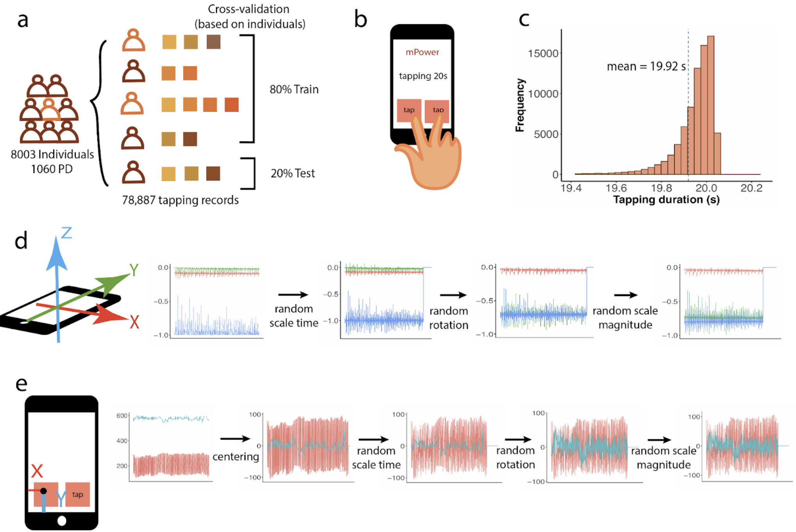

## Fine-motor digital biomarkers performs superior for predicting Parkinson’s disease

### Description

The work is an application of the convolutional neural network (CNN) on the Parkinson's disease predictions using the tapping data, and makes the comparisons with other digital biomarkers such as the gait/rest and the voice. The models come from our winning solution of the 2017 PDDB DREAM Challenge. Please contact (gyuanfan@umich.edu) if you have any questions or suggestions.


---

### Main required dependencies
* [python](https://www.python.org) (2.7.5)
* [Perl](https://www.perl.org/) (5.16.3)
* [Theano](https://pypi.org/project/Theano/1.0.1/) (1.0.1)
* [Lasagne](https://lasagne.readthedocs.io/en/latest/index.html) (0.2.dev1)
* [OpenCV-Python](https://pypi.org/project/opencv-python/) (3.4.0)
* [Numpy](https://numpy.org/) (1.14.3)
* [Scikit-learn](https://scikit-learn.org/) (0.20.3)
Install the dependencies through the provided environment file  
```
pip install -r requirements.txt
```

### Installation
```
git clone ...
```

### Input Data
The tapping data are stored in the .json format. Before given to the model, we transfer them to numpy arrays as the following and save to .npy files. Please check the `extract_coord.py` as an example on extracting the coordinates data from the JSON files.
``` 
# Example of the coordinates processed data
Timstamp        Buttom              Coord_X     Coord_Y
0               TappedButtonLeft    93.5        420
0.0805871250013	TappedButtonNone	255	        418.5
0.229725541667	TappedButtonRight	255	        418.5
...

# Example of the accelerometer processed data
Timstamp          Accel_X           Accel_Y            Accel_Z
9.49009614885e+04 1.61743164062e-03 -5.13153076171e-02 -9.94689941405e-01
9.49009714254e+04 1.05529785156e-01 -6.88781738281e-02 -1.04756164551e+00
9.49009813615e+04 1.39877319336e-01 -6.40563964843e-02 -1.08334350586e+00
...
```

### Models
Codes of the experiments are in the `accel/` and `coord/` folders. Note that to ensemble the models from different data or methods, we directly average the predictions and evaluate, instead of training a new model.
```
# To train the accelerometer models, find the bash.sh in the folder, and run
bash bash.sh
# And to evaluate, run
bash evaluation.sh

# To train the coordinate models, find the train.sh in the folder, and run
bash train.sh
# And to evaluate, run
bash evaluate.sh
```
